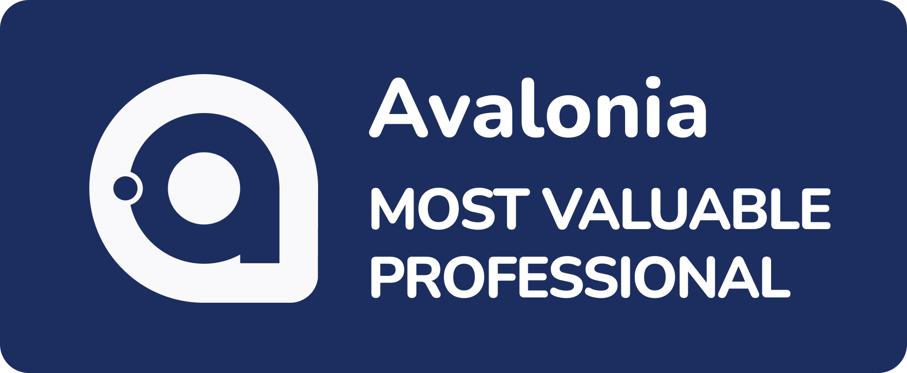

# About me

Hi there :rabbit:

I'm Dong Bin (董彬). You can call me Bunny. He/Him.

#### I'm UI developer

I love UI development. I work on Avalonia, WPF, Blazor and React.

#### I'm CEO of [IRIHI Technology](https://github.com/irihitech)

Our team focus on the aesthetic revolution of productivity.

#### I'm open source community organizer

I'm founder of Avalonia Chinese Community.

I'm organizer of .NET China Community.

#### I'm tech speaker

I'm speaker and lecturer in multiple open-source events. 

### Honors

</img>
</img>

<!--
**rabbitism/rabbitism** is a ✨ _special_ ✨ repository because its `README.md` (this file) appears on your GitHub profile.

Here are some ideas to get you started:

- 🔭 I’m currently working on ...
- 🌱 I’m currently learning ...
- 👯 I’m looking to collaborate on ...
- 🤔 I’m looking for help with ...
- 💬 Ask me about ...
- 📫 How to reach me: ...
- 😄 Pronouns: ...
- ⚡ Fun fact: ...
-->

|  |  |
| ------------- | ------------- |
